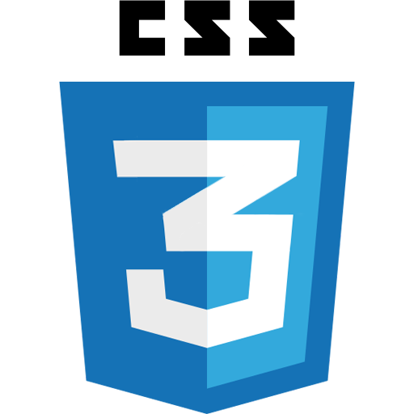
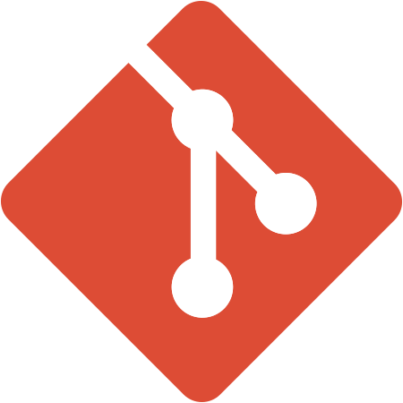
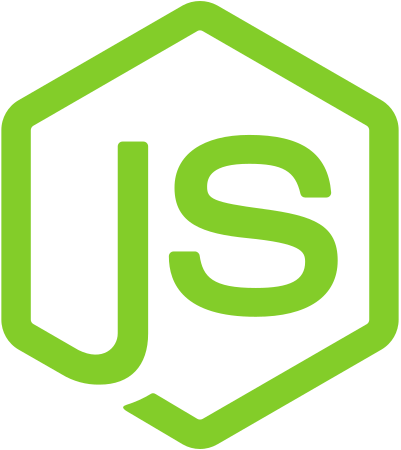

# Hey there! 👋🏼🧔🏼💻
I'm Alejandro, a junior front-end developer looking for new projects.

At this moment, I'm learning and consolidating on my background technologies like React or Node.js, among others... :D


<!--## 🧰 Skills and more...-->
## 🧰 My toolbox
```js
const PEREGRIN_TUK = {
  code: ['Javascript', 'HTML', 'CSS', 'Sass', 'PHP'],
  tools:  {
            toCode: ['Git', 'Node.js', 'React', 'Prepross', 'MySQL'],
            toDesign: ['Figma', 'Photoshop', 'Illustrator', 'InDesign', 'WordPress']
          },
  challenge: 'I resolved to create my personal web'
}
```
<div>
  
  
  
  
  
  
  
  
  
</div>

<!--
## 👨🏻‍💻 Projects

- 🌐 Projecto 1 - Breve descripción.
- 🌐 Projecto 2 - Breve descripción.
- 👾 Projecto 3 - Breve descripción.
- 🤖 Projecto 4 - Breve descripción.
- ...


## 📫 Reach me

Iconos de mis RRSS con enlace a las mismas.

-->